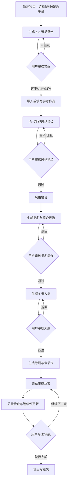

# Codex 执行版 PRD：零基础新人向 AI 小说创作桌面应用

> 目标读者：本地 Codex、项目维护者、产品/工程协作者。  
> 目标仓库：`LJC-god/AI_novel`。  
> 目标形态：在现有 CharacterArc Electron 桌面应用上做增量改造，而不是推倒重写。  
> 核心目标：把当前“专业写作工作台”升级为“零基础新人也能从题材和篇幅出发，经过审核节点，一步步生成可修改、可导出、可投稿小说稿件的本地优先桌面应用”。

---

## 0. 给 Codex 的执行原则

1. **不要重写整个项目。** 当前仓库已经具备 Electron + Vue 3 + TypeScript + SQLite + TipTap + Naive UI + 多模型接入 + Skill 系统 + 章节编辑器 + 拆书导入 + 向量检索 + 章节后处理流水线。首选增量改造。
2. **所有新功能优先走现有架构。** 前端沿用 `renderer/src/pages`、`renderer/src/features`、`renderer/src/stores`；主进程沿用 `electron/main/register-main-ipc.ts`、`workspace-store.ts`、`ai/tasks`、`ai/runtime`、`ai/shared-types.ts`。
3. **所有 AI 输出必须结构化。** 新增任务都必须有 `TaskHandler`、Zod/Schema 校验、JSON 修复路径、AI Run 记录。
4. **每一步都必须有人类审核节点。** 用户不是要“一键乱写整本书”，而是要“系统提供方案 → 用户审核 → 系统继续下一步”。
5. **版权安全优先。** 拆书只沉淀抽象风格、结构、节奏和高层写作规则，不能保存或要求复写大段受版权保护表达；导出前必须有原创性与相似度风险提示。
6. **本地优先、云端可选。** 默认不上传正文、拆书原文、项目资料；只有用户主动配置云模型时才发送对应任务内容。
7. **面向番茄等网文平台，但不承诺收入。** 产品只能帮助提高创作效率、稿件完整度和投稿准备质量，不能承诺签约、流量或稿费。

---

## 1. 背景与现状审计

### 1.1 当前产品定位

当前项目 README 已明确定位为“弧光 · AI 小说创作桌面应用”，它是一套围绕小说项目组织、章节写作与 AI 协作搭建的桌面工作台。当前能力包括：项目中心、新建项目向导、小说流程面板、知识中心、技能系统、世界观/角色/组织/关系管理、关系图谱、剧情大纲、剧情线索、章节创作、AI 辅助、封面工作台、导出等。

这说明当前仓库并不是普通聊天壳，而已经具备小说创作中台能力。新的 PRD 不应把它当成空项目，而应将它升级为“零基础新人创作流水线”。

### 1.2 当前技术栈

当前仓库使用：

- Electron 37
- Vue 3.5
- TypeScript 5.9
- Vite 7 / electron-vite
- Pinia
- Naive UI
- TipTap
- SQLite via `node:sqlite`
- Cytoscape
- Vercel AI SDK
- OpenAI-compatible / Anthropic-compatible provider
- mammoth / marked / docx

这套技术栈适合继续扩展。不要迁移到 React，也不要把桌面应用改成 Web SaaS。

### 1.3 当前可复用资产

| 资产 | 当前存在位置 | 新 PRD 复用方式 |
|---|---|---|
| 项目中心 | `renderer/src/pages/ProjectCenter.vue` | 保留，增加“新人创作向导入口” |
| 新建项目向导 | `renderer/src/pages/ProjectWizardPage.vue` | 改造成“零基础向导”，允许不填书名/简介 |
| 工作台 | `renderer/src/pages/WorkbenchPage.vue` | 保留为高级工作台 |
| 章节创作 | `renderer/src/pages/ChapterStudioPage.vue` | 升级为章节卡 + 正文 + 审稿三栏 |
| 拆书库 | `renderer/src/pages/DeconstructionLibraryPage.vue` | 升级为“拆书风格实验室” |
| Skill 页 | `renderer/src/pages/SkillsPage.vue` | 保留，新增平台/题材/流程型 Skill |
| 封面页 | `renderer/src/pages/CoverWorkbenchPage.vue` | MVP 可保留，V1 增加投稿封面检查 |
| SQLite 主存储 | `electron/main/workspace-store.ts` | 增加工作流阶段、灵感卡、风格指纹、候选书名简介、章节卡、质量报告、投稿包表 |
| AI Runtime | `electron/main/ai/runtime/orchestrator.ts` | 增加新任务 Handler 和 Agent 编排 |
| AI 任务注册 | `electron/main/ai/tasks/index.ts` | 注册新任务 |
| 共享类型 | `electron/main/ai/shared-types.ts` | 增加新 TaskName、Result 类型 |
| 向量检索 | `electron/main/ai/knowledge-retrieval.ts`、`embedding-service.ts` | 用于参考书、章节、世界状态、风格卡检索 |
| 长篇状态库 | `electron/main/story-state-store.ts` | 保留并增强，用于一致性检查 |
| 参考小说导入 | `register-main-ipc.ts` | 扩展导入后进入风格指纹与风格融合流程 |

### 1.4 当前主要不足

1. **向导仍然偏“会写小说的人”。** 当前新建项目向导仍鼓励填写书名和简介；零基础用户往往没有书名、简介、主角、世界观。
2. **拆书结果没有被强制纳入后续生成流水线。** 现有拆书能生成分析和可复用风格 prompt，但缺少“用户审核风格卡 → 风格融合 → 锁定风格 → 后续所有章节引用”的强约束。
3. **大纲与章节生成缺少产品级阶段门。** 当前有大纲/章节能力，但缺少“灵感审核、书名简介审核、大纲审核、卷纲审核、章节卡审核、正文审核”的状态机。
4. **投稿导向不足。** 当前有导出，但没有面向番茄等平台的投稿包、开篇三章检查、字数节奏检查、简介标签检查、合规检查清单。
5. **质量评估未成为主流程。** 一致性、节奏、爽点、AI 味、原创性风险、平台合规等应成为每章生成后的显性面板。
6. **权限和隐私策略需要产品化。** API Key 目前由本地设置保存，后续建议加入 Electron `safeStorage` 加密能力，云端调用必须显示提示。

---

## 2. 产品目标

### 2.1 一句话定位

**CharacterArc ZeroStart：本地优先的 AI 网文创作桌面应用，让零基础新人只选题材和篇幅，也能经过审核式流水线完成灵感、拆书、风格、书名、简介、大纲、章节、修改和投稿包导出。**

### 2.2 核心价值

1. **降低新手启动成本。** 用户不需要先想主角、设定、书名、简介；只需要选择题材、篇幅、平台倾向。
2. **把创作拆成可审核的小步。** 每一步都有多个候选方案、审核按钮、退回重生成、局部修改。
3. **让拆书真正服务后续创作。** 参考作品不用于抄袭，而用于抽象出风格指纹、节奏模板、卖点结构、章节钩子类型。
4. **保证长篇一致性。** 角色状态、伏笔、关系、时间线、世界规则在每章后自动更新，并在下一章生成前检索。
5. **面向投稿闭环。** 输出书名、简介、标签建议、正文、前几章检查、合规报告、字数统计、投稿清单。
6. **适合本地 Codex 持续开发。** 架构清晰、任务拆分明确、每个模块可独立开发测试。

### 2.3 成功指标

| 指标 | MVP 目标 | V1 目标 |
|---|---:|---:|
| 首次创建项目耗时 | 3 分钟内完成题材/篇幅选择并生成灵感卡 | 2 分钟内完成 |
| 灵感卡数量 | 每次 5-8 个 | 支持题材模板动态调参 |
| 审核节点完整度 | 灵感、书名简介、大纲、章节正文 4 个审核点 | 增加风格、卷纲、章节卡、投稿包审核 |
| 结构化输出成功率 | 90%+，失败可修复 | 95%+ |
| 一章生成后质量报告 | 基础一致性 + 字数 + 风格漂移 | 增加节奏、爽点、AI 味、合规、伏笔健康度 |
| 投稿包导出 | txt/docx/json + checklist | 增加平台模板、标签建议、封面 prompt |
| 本地模型可用性 | Ollama / LM Studio / OpenAI-compatible 任一跑通 | 支持模型角色分配和自动降级 |

---

## 3. 用户画像

### 3.1 核心用户：零基础网文新人

- 不知道写什么题材，只大概知道想写都市、玄幻、古言、悬疑等。
- 不会搭大纲，不知道前几章怎么吸引读者。
- 想在番茄等平台投稿，但不知道需要准备什么。
- 希望 AI 给灵感，但不希望完全失控。
- 需要简单明确的“下一步”按钮。

### 3.2 进阶用户：已有写作经验的作者

- 有题材和大纲，但想用 AI 加速拆书、章节卡、润色和一致性检查。
- 需要高级工作台、世界书、关系图谱、AI 侧边栏、章节历史版本。
- 希望保留自由编辑能力。

### 3.3 系统管理员/开发者

- 需要接入本地模型、云模型、中转 API。
- 需要调试 Prompt、Skill、任务、Schema、工作流状态机。
- 需要通过 Codex 逐步开发、测试、重构。

---

## 4. 产品范围

### 4.1 MVP 必做

1. 零基础新建向导 V2：只选题材、篇幅、平台倾向、读者向。
2. 灵感卡生成与审核。
3. 参考作品拆书风格卡审核。
4. 多参考作品风格融合。
5. 书名与简介候选生成、审核。
6. 全书大纲生成、审核。
7. 卷纲与章节卡生成。
8. 逐章正文生成。
9. 章节后质量报告：一致性、字数、风格漂移、风险提示。
10. 投稿包导出：书名、简介、标签、正文、章节列表、检查清单。
11. SQLite 新表与迁移。
12. IPC 与前端 Store。
13. 新 AI 任务 Handler 与 Schema。
14. 本地模型配置说明和模型角色分配基础版。

### 4.2 V1 必做

1. 题材模板库：都市、玄幻、仙侠、科幻、悬疑、古言、现言、脑洞、历史、轻小说等。
2. 平台模板库：番茄、起点、晋江、七猫、知乎盐言等。
3. 风格库：用户可保存、复用、混合风格指纹。
4. 高级质量评估：节奏、爽点、情绪曲线、断章钩子、AI 味、重复表达、原创性风险。
5. 长篇连续性面板：伏笔健康度、关系曲线、角色弧光、世界规则冲突。
6. 投稿日更计划：每日 4000/6000/8000 字目标、存稿天数、预计完结日期。
7. 提示词/Skill 插件市场或本地插件导入。
8. API Key 本地加密。
9. 自动备份和导入导出完整项目包。

### 4.3 暂不做

1. 自动登录番茄后台并自动投稿。
2. 承诺收益、签约、流量。
3. Web SaaS 版本。
4. 多人实时协作。
5. 训练专属大模型。
6. 自动抓取盗版小说正文。

---

## 5. 主流程设计

### 5.1 用户主流程



### 5.2 阶段状态机

新增项目级状态字段 `workflow_phase`，阶段如下：

```ts
export type ZeroStartWorkflowPhase =
  | 'created'
  | 'idea_generating'
  | 'idea_review'
  | 'idea_approved'
  | 'style_collecting'
  | 'style_review'
  | 'style_approved'
  | 'synopsis_generating'
  | 'synopsis_review'
  | 'synopsis_approved'
  | 'outline_generating'
  | 'outline_review'
  | 'outline_approved'
  | 'chapter_cards_generating'
  | 'chapter_cards_review'
  | 'drafting'
  | 'revision'
  | 'export_ready'
  | 'submitted_archive'
```

阶段流转规则：

| 当前阶段 | 可执行操作 | 下个阶段 | 约束 |
|---|---|---|---|
| created | 生成灵感 | idea_generating | 必须有 genre、targetWords、platform |
| idea_generating | 生成完成 | idea_review | 至少 5 张灵感卡 |
| idea_review | 选择灵感 | idea_approved | 至少 1 张卡 approved |
| idea_approved | 开始拆书 | style_collecting | 可跳过拆书，但需选择系统默认风格 |
| style_collecting | 风格卡生成 | style_review | 支持多本参考书 |
| style_review | 审核风格 | style_approved | 必须有 avoidRules |
| style_approved | 生成书名简介 | synopsis_generating | 读取 approved idea + approved style |
| synopsis_generating | 生成完成 | synopsis_review | 至少 3 组候选 |
| synopsis_review | 审核通过 | synopsis_approved | 只能有 1 组 active |
| synopsis_approved | 生成大纲 | outline_generating | 必须锁定书名简介 |
| outline_generating | 生成完成 | outline_review | 生成全书结构树 |
| outline_review | 审核通过 | outline_approved | 生成版本快照 |
| outline_approved | 生成章节卡 | chapter_cards_generating | 可按卷生成 |
| chapter_cards_generating | 生成完成 | chapter_cards_review | 每章必须有目标、冲突、钩子 |
| chapter_cards_review | 开始写作 | drafting | 章节卡可单章审核 |
| drafting | 章节生成/修改 | revision | 每章生成后进入质量报告 |
| revision | 继续下一章 | drafting | 用户确认或修改后继续 |
| revision | 导出 | export_ready | 至少 3 章或用户手动允许 |

---

## 6. 页面与交互设计

### 6.1 页面总览

| 页面 | 现有/新增 | 路径建议 | 说明 |
|---|---|---|---|
| 项目中心 | 现有增强 | `ProjectCenter.vue` | 新增“零基础创建”按钮、项目阶段标签 |
| 零基础向导 | 改造/新增 | `ZeroStartWizardPage.vue` 或改造 `ProjectWizardPage.vue` | 只选题材、篇幅、平台、读者向 |
| 灵感审核页 | 新增 | `renderer/src/features/zeroStart/IdeaReviewPanel.vue` | 多卡片对比、选择、合并、重生成 |
| 拆书风格实验室 | 增强 | `DeconstructionLibraryPage.vue` | 加入风格指纹审核与融合 |
| 书名简介审核页 | 新增 | `TitleSynopsisReviewPanel.vue` | 书名、简介、卖点、标签候选 |
| 大纲设计页 | 增强 | `WorkbenchPage.vue` / `OutlineBoard.vue` | 全书大纲、卷纲、章节卡 |
| 章节创作页 | 增强 | `ChapterStudioPage.vue` | 左章节卡、中正文、右质量报告 |
| 投稿包导出页 | 新增 | `SubmissionPackagePage.vue` | 导出正文、简介、标签、检查清单 |
| 设置页 | 现有增强 | settings component | 模型角色、隐私、API Key、导出路径 |

### 6.2 零基础向导字段

字段：

```ts
export type ZeroStartWizardInput = {
  genreKey: string
  customGenre?: string
  targetLength: 'short_100k' | 'medium_300k' | 'long_800k' | 'super_long_1200k'
  targetWords: number
  platform: 'fanqie' | 'qidian' | 'jinjiang' | 'qimao' | 'zhihu' | 'generic'
  audience: 'male' | 'female' | 'general'
  tone: '爽文' | '现实' | '轻松' | '悬疑' | '甜宠' | '权谋' | '热血' | '自定义'
  userSeed?: string
  cloudAllowed: boolean
}
```

交互：

1. 默认不要求书名、简介、主角。
2. 用户只选题材和篇幅也能继续。
3. `userSeed` 是可选补充，placeholder：`可不填。比如：我想写一个普通人靠信息差翻身的故事。`
4. 点击“生成灵感卡”后进入灵感审核页。

### 6.3 灵感审核页字段

```ts
export type InspirationCard = {
  id: string
  projectId: string
  batchId: string
  title: string
  oneLineHook: string
  genre: string
  targetWords: number
  protagonistDesign: string
  protagonistGap: string
  coreConflict: string
  openingHooks: string[]
  longTermDrive: string
  commercialSellingPoints: string[]
  riskNotes: string[]
  tags: string[]
  status: 'candidate' | 'liked' | 'approved' | 'rejected' | 'merged'
  createdAt: string
  updatedAt: string
}
```

交互：

- 卡片操作：喜欢、拒绝、设为主方案、与另一张合并、局部改写、重生成同类。
- 用户可以选 1 张为主，也可以选择 2-3 张融合。
- 审核通过后写入 `approved_idea_snapshot_json`。

### 6.4 拆书风格实验室字段

```ts
export type StyleFingerprint = {
  id: string
  projectId: string
  sourceReferenceIds: string[]
  title: string
  sellPointPattern: string
  protagonistEngine: string
  conflictEngine: string
  povRule: string
  pacingRule: string
  chapterHookTypes: string[]
  sentenceRegister: {
    avgSentenceLength: string
    dialogueRatio: string
    metaphorDensity: string
    colloquialLevel: string
    narrationTemperature: string
  }
  emotionCurve: string
  structurePattern: string
  reusableRules: string[]
  avoidRules: string[]
  copyrightSafetyNote: string
  status: 'draft' | 'approved' | 'archived'
  createdAt: string
  updatedAt: string
}
```

交互：

- 支持导入 `.txt`、`.md`、`.docx`，复用现有参考小说导入逻辑。
- 不直接展示或鼓励复写原文。
- 每个参考书生成一张风格卡。
- 多风格卡可融合为项目主风格。
- 用户必须确认 `avoidRules` 后才能继续生成正文。

### 6.5 书名简介审核页字段

```ts
export type TitleSynopsisCandidate = {
  id: string
  projectId: string
  title: string
  subtitle?: string
  introShort: string
  introLong: string
  sellingPoints: string[]
  tags: string[]
  targetPlatform: string
  audiencePromise: string
  openingExpectation: string
  riskNotes: string[]
  status: 'candidate' | 'approved' | 'rejected'
  createdAt: string
}
```

交互：

- 一次生成 5 个书名 + 3 个简介方向。
- 可锁定书名但重生成简介。
- 可锁定简介但重生成书名。
- 通过后把书名写回 `projects.title`，简介写入 `workflow_documents` 或新增 `project_synopsis` 表。

### 6.6 大纲与章节卡页字段

```ts
export type MasterOutline = {
  projectId: string
  logline: string
  theme: string
  mainConflict: string
  actStructure: Array<{
    act: string
    purpose: string
    startState: string
    endState: string
    keyReversal: string
  }>
  volumes: Array<{
    title: string
    targetWords: number
    summary: string
    majorConflict: string
    climax: string
    hookToNextVolume: string
  }>
  subplotThreads: Array<{
    title: string
    purpose: string
    openAt: string
    payoffAt: string
  }>
}

export type ChapterCard = {
  id: string
  projectId: string
  volumeId: string
  chapterNo: number
  title: string
  targetWords: number
  pov: string
  chapterGoal: string
  coreConflict: string
  scenes: Array<{
    order: number
    location: string
    participants: string[]
    purpose: string
    conflict: string
    outcome: string
  }>
  informationGain: string[]
  emotionalBeat: string
  hookEnding: string
  continuityRequirements: string[]
  styleRequirements: string[]
  status: 'planned' | 'approved' | 'drafting' | 'drafted' | 'revising' | 'final'
}
```

交互：

- 全书大纲必须先审核。
- 章节卡可按卷批量生成。
- 每章正文生成前必须有 `approved` 章节卡，除非用户开启“快速试写模式”。

### 6.7 章节创作页改造

三栏布局：

1. 左栏：卷/章节树 + 章节卡摘要 + 状态。
2. 中栏：TipTap 正文编辑器 + 生成/续写/改写/润色按钮。
3. 右栏：质量报告 + 连续性警告 + 风格漂移 + 投稿风险。

新增右栏组件：

```ts
export type ChapterQualityReport = {
  id: string
  projectId: string
  chapterId: string
  wordCount: number
  targetWordCount: number
  pacingScore: number
  hookScore: number
  styleMatchScore: number
  continuityScore: number
  originalityRisk: 'low' | 'medium' | 'high'
  aiFlavorRisk: 'low' | 'medium' | 'high'
  platformRisk: Array<{ severity: 'info' | 'warning' | 'error'; message: string }>
  issues: Array<{ severity: 'critical' | 'warning' | 'hint'; category: string; message: string; suggestion: string }>
  passed: boolean
  createdAt: string
}
```

---

## 7. 数据库设计

### 7.1 保留现有表

保留 `workspace-store.ts` 中已有表：

- `projects`
- `worldview_entries`
- `characters`
- `organizations`
- `character_relationships`
- `organization_memberships`
- `inspiration_entries`
- `outline_volumes`
- `outline_items`
- `chapters`
- `chapter_versions`
- `ai_messages`
- `knowledge_documents`
- `reference_works`
- `ai_runs`
- `workflow_documents`
- `plot_threads`
- `app_settings`
- `cover_workbench_history`
- `assistant_sessions`
- `story_character_state`
- `story_foreshadowing`
- `story_relationships`
- `story_timeline`
- `story_world_rules`
- `story_countdown_clocks`
- `story_embeddings`
- `embedding_metadata`

### 7.2 新增表 DDL

将以下 DDL 加入 `workspace-store.ts` 的 schema 初始化，并写 `ensureZeroStartColumns(db)` 迁移函数。

```sql
CREATE TABLE IF NOT EXISTS project_workflow_state (
  project_id TEXT PRIMARY KEY,
  workflow_phase TEXT NOT NULL DEFAULT 'created',
  approved_idea_id TEXT NOT NULL DEFAULT '',
  approved_style_id TEXT NOT NULL DEFAULT '',
  approved_synopsis_id TEXT NOT NULL DEFAULT '',
  approved_outline_snapshot_id TEXT NOT NULL DEFAULT '',
  current_volume_id TEXT NOT NULL DEFAULT '',
  current_chapter_id TEXT NOT NULL DEFAULT '',
  target_platform TEXT NOT NULL DEFAULT 'fanqie',
  target_words INTEGER NOT NULL DEFAULT 800000,
  audience TEXT NOT NULL DEFAULT 'general',
  zero_start_mode INTEGER NOT NULL DEFAULT 1,
  cloud_allowed INTEGER NOT NULL DEFAULT 0,
  created_at TEXT NOT NULL,
  updated_at TEXT NOT NULL,
  FOREIGN KEY (project_id) REFERENCES projects(id) ON DELETE CASCADE
) STRICT;

CREATE TABLE IF NOT EXISTS inspiration_cards (
  id TEXT PRIMARY KEY,
  project_id TEXT NOT NULL,
  batch_id TEXT NOT NULL,
  title TEXT NOT NULL,
  one_line_hook TEXT NOT NULL,
  genre TEXT NOT NULL,
  target_words INTEGER NOT NULL,
  protagonist_design TEXT NOT NULL,
  protagonist_gap TEXT NOT NULL,
  core_conflict TEXT NOT NULL,
  opening_hooks_json TEXT NOT NULL DEFAULT '[]',
  long_term_drive TEXT NOT NULL,
  commercial_selling_points_json TEXT NOT NULL DEFAULT '[]',
  risk_notes_json TEXT NOT NULL DEFAULT '[]',
  tags_json TEXT NOT NULL DEFAULT '[]',
  status TEXT NOT NULL DEFAULT 'candidate',
  created_at TEXT NOT NULL,
  updated_at TEXT NOT NULL,
  FOREIGN KEY (project_id) REFERENCES projects(id) ON DELETE CASCADE
) STRICT;

CREATE INDEX IF NOT EXISTS idx_inspiration_cards_project_status
  ON inspiration_cards(project_id, status);

CREATE TABLE IF NOT EXISTS style_fingerprints (
  id TEXT PRIMARY KEY,
  project_id TEXT NOT NULL,
  source_reference_ids_json TEXT NOT NULL DEFAULT '[]',
  title TEXT NOT NULL,
  sell_point_pattern TEXT NOT NULL,
  protagonist_engine TEXT NOT NULL,
  conflict_engine TEXT NOT NULL,
  pov_rule TEXT NOT NULL,
  pacing_rule TEXT NOT NULL,
  chapter_hook_types_json TEXT NOT NULL DEFAULT '[]',
  sentence_register_json TEXT NOT NULL DEFAULT '{}',
  emotion_curve TEXT NOT NULL,
  structure_pattern TEXT NOT NULL,
  reusable_rules_json TEXT NOT NULL DEFAULT '[]',
  avoid_rules_json TEXT NOT NULL DEFAULT '[]',
  copyright_safety_note TEXT NOT NULL DEFAULT '',
  status TEXT NOT NULL DEFAULT 'draft',
  created_at TEXT NOT NULL,
  updated_at TEXT NOT NULL,
  FOREIGN KEY (project_id) REFERENCES projects(id) ON DELETE CASCADE
) STRICT;

CREATE TABLE IF NOT EXISTS title_synopsis_candidates (
  id TEXT PRIMARY KEY,
  project_id TEXT NOT NULL,
  title TEXT NOT NULL,
  subtitle TEXT NOT NULL DEFAULT '',
  intro_short TEXT NOT NULL,
  intro_long TEXT NOT NULL,
  selling_points_json TEXT NOT NULL DEFAULT '[]',
  tags_json TEXT NOT NULL DEFAULT '[]',
  target_platform TEXT NOT NULL DEFAULT 'fanqie',
  audience_promise TEXT NOT NULL,
  opening_expectation TEXT NOT NULL,
  risk_notes_json TEXT NOT NULL DEFAULT '[]',
  status TEXT NOT NULL DEFAULT 'candidate',
  created_at TEXT NOT NULL,
  updated_at TEXT NOT NULL,
  FOREIGN KEY (project_id) REFERENCES projects(id) ON DELETE CASCADE
) STRICT;

CREATE TABLE IF NOT EXISTS outline_snapshots (
  id TEXT PRIMARY KEY,
  project_id TEXT NOT NULL,
  version_no INTEGER NOT NULL DEFAULT 1,
  outline_json TEXT NOT NULL DEFAULT '{}',
  status TEXT NOT NULL DEFAULT 'draft',
  created_at TEXT NOT NULL,
  approved_at TEXT NOT NULL DEFAULT '',
  FOREIGN KEY (project_id) REFERENCES projects(id) ON DELETE CASCADE
) STRICT;

CREATE TABLE IF NOT EXISTS chapter_cards (
  id TEXT PRIMARY KEY,
  project_id TEXT NOT NULL,
  volume_id TEXT NOT NULL,
  chapter_id TEXT NOT NULL DEFAULT '',
  chapter_no INTEGER NOT NULL,
  title TEXT NOT NULL,
  target_words INTEGER NOT NULL DEFAULT 2500,
  pov TEXT NOT NULL DEFAULT '',
  chapter_goal TEXT NOT NULL,
  core_conflict TEXT NOT NULL,
  scenes_json TEXT NOT NULL DEFAULT '[]',
  information_gain_json TEXT NOT NULL DEFAULT '[]',
  emotional_beat TEXT NOT NULL DEFAULT '',
  hook_ending TEXT NOT NULL DEFAULT '',
  continuity_requirements_json TEXT NOT NULL DEFAULT '[]',
  style_requirements_json TEXT NOT NULL DEFAULT '[]',
  status TEXT NOT NULL DEFAULT 'planned',
  created_at TEXT NOT NULL,
  updated_at TEXT NOT NULL,
  FOREIGN KEY (project_id) REFERENCES projects(id) ON DELETE CASCADE,
  FOREIGN KEY (volume_id) REFERENCES outline_volumes(id) ON DELETE CASCADE
) STRICT;

CREATE INDEX IF NOT EXISTS idx_chapter_cards_project_volume
  ON chapter_cards(project_id, volume_id, chapter_no);

CREATE TABLE IF NOT EXISTS chapter_quality_reports (
  id TEXT PRIMARY KEY,
  project_id TEXT NOT NULL,
  chapter_id TEXT NOT NULL,
  word_count INTEGER NOT NULL DEFAULT 0,
  target_word_count INTEGER NOT NULL DEFAULT 0,
  pacing_score REAL NOT NULL DEFAULT 0,
  hook_score REAL NOT NULL DEFAULT 0,
  style_match_score REAL NOT NULL DEFAULT 0,
  continuity_score REAL NOT NULL DEFAULT 0,
  originality_risk TEXT NOT NULL DEFAULT 'low',
  ai_flavor_risk TEXT NOT NULL DEFAULT 'low',
  platform_risk_json TEXT NOT NULL DEFAULT '[]',
  issues_json TEXT NOT NULL DEFAULT '[]',
  passed INTEGER NOT NULL DEFAULT 0,
  created_at TEXT NOT NULL,
  FOREIGN KEY (project_id) REFERENCES projects(id) ON DELETE CASCADE,
  FOREIGN KEY (chapter_id) REFERENCES chapters(id) ON DELETE CASCADE
) STRICT;

CREATE TABLE IF NOT EXISTS submission_packages (
  id TEXT PRIMARY KEY,
  project_id TEXT NOT NULL,
  target_platform TEXT NOT NULL DEFAULT 'fanqie',
  title TEXT NOT NULL,
  intro_short TEXT NOT NULL,
  intro_long TEXT NOT NULL,
  tags_json TEXT NOT NULL DEFAULT '[]',
  manuscript_path TEXT NOT NULL DEFAULT '',
  checklist_json TEXT NOT NULL DEFAULT '[]',
  risk_report_json TEXT NOT NULL DEFAULT '{}',
  export_format TEXT NOT NULL DEFAULT 'folder',
  created_at TEXT NOT NULL,
  FOREIGN KEY (project_id) REFERENCES projects(id) ON DELETE CASCADE
) STRICT;

CREATE TABLE IF NOT EXISTS workflow_runs (
  id TEXT PRIMARY KEY,
  project_id TEXT NOT NULL,
  workflow_name TEXT NOT NULL,
  phase TEXT NOT NULL,
  status TEXT NOT NULL DEFAULT 'running',
  input_json TEXT NOT NULL DEFAULT '{}',
  output_json TEXT NOT NULL DEFAULT '{}',
  error TEXT NOT NULL DEFAULT '',
  started_at TEXT NOT NULL,
  finished_at TEXT NOT NULL DEFAULT '',
  FOREIGN KEY (project_id) REFERENCES projects(id) ON DELETE CASCADE
) STRICT;

CREATE TABLE IF NOT EXISTS workflow_run_steps (
  id TEXT PRIMARY KEY,
  run_id TEXT NOT NULL,
  step_name TEXT NOT NULL,
  agent_name TEXT NOT NULL,
  status TEXT NOT NULL DEFAULT 'pending',
  input_json TEXT NOT NULL DEFAULT '{}',
  output_json TEXT NOT NULL DEFAULT '{}',
  error TEXT NOT NULL DEFAULT '',
  started_at TEXT NOT NULL DEFAULT '',
  finished_at TEXT NOT NULL DEFAULT '',
  FOREIGN KEY (run_id) REFERENCES workflow_runs(id) ON DELETE CASCADE
) STRICT;
```

---

## 8. AI 任务与 Agent 架构

### 8.1 新增 AI TaskName

在 `electron/main/ai/shared-types.ts` 的 `AiTaskName` 中新增：

```ts
| 'zero-idea-cards'
| 'zero-idea-merge'
| 'style-fingerprint-normalize'
| 'style-fusion-project'
| 'title-synopsis-generate'
| 'master-outline-generate'
| 'volume-outline-generate'
| 'chapter-cards-generate'
| 'chapter-draft-v2'
| 'chapter-quality-audit'
| 'submission-package-generate'
```

### 8.2 新增任务文件

在 `electron/main/ai/tasks/` 新增：

```text
zero-idea-cards.ts
zero-idea-merge.ts
style-fingerprint-normalize.ts
style-fusion-project.ts
title-synopsis-generate.ts
master-outline-generate.ts
volume-outline-generate.ts
chapter-cards-generate.ts
chapter-draft-v2.ts
chapter-quality-audit.ts
submission-package-generate.ts
```

并在 `electron/main/ai/tasks/index.ts` 注册。

### 8.3 Agent 分工

| Agent | 任务 | 输入 | 输出 |
|---|---|---|---|
| NewbieGuideAgent | 解释下一步、生成用户可理解的选项 | workflow state | next action |
| IdeationAgent | 生成灵感卡 | 题材、篇幅、平台、读者向 | inspiration_cards |
| IdeaEditorAgent | 合并/改写灵感卡 | 多张卡 + 用户偏好 | merged card |
| DeconstructionAgent | 拆书分析 | 参考书分块、统计、项目目标 | style fingerprint draft |
| StyleFusionAgent | 融合多本参考书 | 多张风格卡 | project style fingerprint |
| TitleSynopsisAgent | 书名简介 | approved idea + style | candidates |
| OutlineArchitectAgent | 全书大纲 | approved synopsis + style | master outline |
| VolumePlannerAgent | 卷纲 | master outline | volumes |
| ChapterCardAgent | 章节卡 | volume outline + memory | chapter cards |
| DraftWriterAgent | 正文 | chapter card + style + memory | draft |
| ContinuityAuditorAgent | 连续性检查 | draft + story state | report |
| RevisionAgent | 修改 | report + user instruction | revised draft |
| SubmissionAgent | 投稿准备 | project + chapters | package checklist |

### 8.4 编排方式

MVP 不强制所有任务都走 tool-use Agent Loop；优先使用现有 `runAiTask` 单任务路径，确保稳定。只有以下任务建议走 Agent Loop：

- `global-assistant-proposal`
- `reference-deep-analyze`
- `submission-package-generate`
- V1 的“自动修复多处章节问题”

其他任务走结构化输出即可。

### 8.5 Prompt 设计原则

1. system 中定义角色、边界、版权规则、输出格式。
2. user 中放项目上下文、已审核结果、约束和待生成目标。
3. 输出必须 JSON，不要混入解释。
4. 每个字段必须可落库。
5. 每个任务必须有 `avoidRules` 或 `riskNotes` 字段，供质量检查和投稿预检使用。

### 8.6 核心 Prompt 模板

#### zero-idea-cards

```text
系统：你是网文策划总编和新手教练。用户是零基础作者，只提供题材、篇幅、平台和读者向。你要给出 5-8 个差异明显、可持续写成长篇的原创故事灵感卡。不得模仿具体作者原句，不得复写已知作品设定。

用户：
题材：{{genre}}
篇幅：{{targetWords}}
平台：{{platform}}
读者向：{{audience}}
用户补充：{{userSeed}}

输出 JSON：{ cards: InspirationCard[] }
```

#### style-fusion-project

```text
系统：你是风格融合编辑。你只能融合抽象风格特征，不能复写任何参考书原文。你的目标是形成一个适合当前项目的原创风格指纹。

输入：approved idea、style fingerprints、target platform。
输出：StyleFingerprint JSON。
```

#### chapter-draft-v2

```text
系统：你是章节导演和正文写手。必须遵守 approved chapter card、project style fingerprint、story state、avoid rules。不得擅自改变主线设定。结尾必须有钩子。

输入：chapter card、style fingerprint、recent summaries、story state、semantic segments。
输出：{ title, content, selfCheck }
```

---

## 9. IPC/API 契约

沿用 `window.characterArc` 桥接层和 `characterarc:*` 命名空间。

### 9.1 新增 IPC handler

```ts
'characterarc:zero-workflow-state-get'
'characterarc:zero-workflow-state-update'
'characterarc:zero-ideas-generate'
'characterarc:zero-idea-approve'
'characterarc:zero-idea-merge'
'characterarc:style-fingerprint-save'
'characterarc:style-fusion-generate'
'characterarc:title-synopsis-generate'
'characterarc:title-synopsis-approve'
'characterarc:master-outline-generate'
'characterarc:master-outline-approve'
'characterarc:chapter-cards-generate'
'characterarc:chapter-card-approve'
'characterarc:chapter-draft-v2'
'characterarc:chapter-quality-audit'
'characterarc:submission-package-generate'
'characterarc:submission-package-export'
```

### 9.2 API 示例

```ts
export type ZeroIdeasGenerateRequest = {
  projectId: string
  input: ZeroStartWizardInput
  settings: AppSettings
}

export type ZeroIdeasGenerateResponse = {
  success: boolean
  cards?: InspirationCard[]
  aiRunMeta?: AiRunMeta
  error?: string
}
```

```ts
export type ChapterDraftV2Request = {
  projectId: string
  chapterCardId: string
  settings: AppSettings
  stream?: boolean
}

export type ChapterDraftV2Response = {
  success: boolean
  chapterId?: string
  content?: string
  qualityReport?: ChapterQualityReport
  aiRunMeta?: AiRunMeta
  error?: string
}
```

### 9.3 预加载桥接

在 `electron/preload` 的类型定义中暴露：

```ts
zeroGenerateIdeas(payload: ZeroIdeasGenerateRequest): Promise<ZeroIdeasGenerateResponse>
approveIdea(projectId: string, ideaId: string): Promise<{ success: boolean }>
generateStyleFusion(payload: StyleFusionRequest): Promise<StyleFusionResponse>
generateTitleSynopsis(payload: TitleSynopsisRequest): Promise<TitleSynopsisResponse>
generateMasterOutline(payload: MasterOutlineRequest): Promise<MasterOutlineResponse>
generateChapterCards(payload: ChapterCardsRequest): Promise<ChapterCardsResponse>
generateChapterDraftV2(payload: ChapterDraftV2Request): Promise<ChapterDraftV2Response>
generateSubmissionPackage(payload: SubmissionPackageRequest): Promise<SubmissionPackageResponse>
```

---

## 10. DDD 模块划分与目录结构

### 10.1 主进程新增目录

```text
electron/main/zero-start/
├── workflow-state.ts
├── repositories/
│   ├── inspiration-card-repo.ts
│   ├── style-fingerprint-repo.ts
│   ├── synopsis-candidate-repo.ts
│   ├── outline-snapshot-repo.ts
│   ├── chapter-card-repo.ts
│   ├── quality-report-repo.ts
│   └── submission-package-repo.ts
├── services/
│   ├── zero-workflow-service.ts
│   ├── idea-review-service.ts
│   ├── style-fusion-service.ts
│   ├── outline-approval-service.ts
│   ├── chapter-draft-service.ts
│   └── submission-export-service.ts
└── schemas/
    ├── zero-workflow-schema.ts
    ├── inspiration-card-schema.ts
    ├── style-fingerprint-schema.ts
    ├── title-synopsis-schema.ts
    ├── outline-schema.ts
    ├── chapter-card-schema.ts
    └── quality-report-schema.ts
```

### 10.2 渲染层新增目录

```text
renderer/src/features/zeroStart/
├── components/
│   ├── ZeroStartWizard.vue
│   ├── IdeaCardGrid.vue
│   ├── IdeaReviewPanel.vue
│   ├── StyleFingerprintPanel.vue
│   ├── StyleFusionPanel.vue
│   ├── TitleSynopsisReviewPanel.vue
│   ├── MasterOutlineReviewPanel.vue
│   ├── ChapterCardBoard.vue
│   ├── ChapterQualityPanel.vue
│   └── SubmissionPackagePanel.vue
├── composables/
│   ├── useZeroWorkflow.ts
│   ├── useIdeaCards.ts
│   ├── useStyleFingerprints.ts
│   ├── useTitleSynopsis.ts
│   ├── useChapterCards.ts
│   └── useSubmissionPackage.ts
├── types.ts
└── constants.ts
```

### 10.3 Store 改造

在 `renderer/src/stores/app` 或新建 `renderer/src/stores/zeroStart.ts`：

```ts
export const useZeroStartStore = defineStore('zeroStart', {
  state: () => ({
    workflowStateByProject: {} as Record<string, ProjectWorkflowState>,
    inspirationCardsByProject: {} as Record<string, InspirationCard[]>,
    styleFingerprintsByProject: {} as Record<string, StyleFingerprint[]>,
    synopsisCandidatesByProject: {} as Record<string, TitleSynopsisCandidate[]>,
    chapterCardsByProject: {} as Record<string, ChapterCard[]>,
    qualityReportsByChapter: {} as Record<string, ChapterQualityReport[]>,
    isRunning: false,
    activeRunId: ''
  })
})
```

---

## 11. 本地模型与云模型接入规范

### 11.1 模型角色

新增默认模型角色：

| roleId | 作用 | 推荐模型类型 |
|---|---|---|
| ideation | 灵感发散 | 快速、便宜、本地 7B-14B 可用 |
| planner | 大纲/结构 | 强推理、长上下文 |
| writer | 正文扩写 | 中文表达强、风格稳定 |
| auditor | 审稿/一致性 | 严格、结构化输出稳定 |
| embedding | 向量检索 | embedding API |
| image | 封面 prompt/图像 | 图像模型 |

### 11.2 Ollama

配置示例：

```json
{
  "provider": "ollama",
  "baseUrl": "http://127.0.0.1:11434/v1",
  "apiKey": "ollama",
  "model": "qwen3:14b",
  "embeddingModel": "nomic-embed-text"
}
```

要求：

- API Key 可为空或填占位符，但 transport 层要允许本地服务无鉴权。
- 若 embedding 不可用，向量检索降级为状态块 + 关键词检索。
- 超时默认 180 秒，长章节可设置为 300 秒。

### 11.3 LM Studio

配置示例：

```json
{
  "provider": "openai-compatible",
  "baseUrl": "http://127.0.0.1:1234/v1",
  "apiKey": "lm-studio",
  "model": "qwen/qwen3-32b",
  "embeddingModel": "text-embedding-nomic-embed-text-v1.5"
}
```

要求：

- 默认只连接 loopback 地址。
- 如果用户暴露到局域网，设置页必须显示风险提示。

### 11.4 OpenAI-compatible 云模型

配置示例：

```json
{
  "provider": "openai",
  "baseUrl": "https://api.openai.com/v1",
  "apiKey": "sk-...",
  "model": "gpt-5.5-pro",
  "embeddingModel": "text-embedding-3-small"
}
```

要求：

- 每次云端调用正文/参考资料前，若项目 `cloud_allowed = 0`，必须弹窗确认。
- AI Run 记录中保存 provider、model、usage、usedSkills、usedKnowledge。

---

## 12. 向量库与知识库方案

### 12.1 现有方案保留

当前 `story_embeddings` 以 BLOB 存储向量，`embedding_metadata` 记录维度。MVP 保留这种方案。

### 12.2 新增 source_type

`story_embeddings.source_type` 增加枚举：

- `chapter_segment`
- `reference_segment`
- `style_fingerprint`
- `outline_node`
- `canon_fact`
- `quality_report`

### 12.3 检索策略

1. 章节生成前：检索 `story state + outline + style + recent chapters + semantic segments`。
2. 章节审稿时：检索同角色最近状态、同伏笔相关章节、同地点世界规则。
3. 风格融合时：检索已批准的风格卡，不检索原文大段。
4. 投稿导出时：检索质量报告和章节状态，生成 checklist。

---

## 13. 质量评估体系

### 13.1 每章必检

| 检查项 | 说明 | MVP |
|---|---|---|
| 字数 | 是否接近章节目标字数 | 是 |
| 章节目标 | 是否完成章节卡目标 | 是 |
| 冲突 | 是否有本章核心冲突 | 是 |
| 结尾钩子 | 是否能促使读者继续读 | 是 |
| 连续性 | 角色状态/时间线/道具是否冲突 | 是 |
| 风格匹配 | 是否符合 approved style | 是 |
| AI 味 | 套话、过度总结、空泛形容 | V1 |
| 原创性风险 | 与参考作品是否过近 | V1 |
| 平台合规 | 敏感内容、低俗、极端暴力等 | MVP 基础，V1 增强 |

### 13.2 评分规则

`ChapterQualityReport.passed = true` 条件：

- `continuityScore >= 70`
- `styleMatchScore >= 65`
- 没有 `critical` issue
- 字数不少于目标的 70%

MVP 不因为评分低阻止用户继续，但必须显示风险。

---

## 14. 投稿包导出

### 14.1 导出内容

```text
submission-package/
├── 00_投稿清单.md
├── 01_书名与简介.md
├── 02_标签与卖点.md
├── 03_全书大纲.md
├── 04_章节目录.md
├── 05_正文.txt
├── 05_正文.docx
├── 06_质量报告.json
├── 07_平台风险提示.md
└── project-snapshot.json
```

### 14.2 投稿清单

- 书名是否为空
- 简介是否有开篇钩子
- 标签是否完整
- 前三章是否有强事件
- 章节字数是否稳定
- 是否有未解决的 critical issue
- 是否有版权/风格过近风险
- 是否达到用户设定的投稿字数
- 是否已人工通读

---

## 15. 安全、隐私与版权

### 15.1 本地数据

- 默认所有正文、参考书、风格卡、知识库、AI Run 保存在本地 SQLite 和 userData 子目录。
- 不自动上传。
- 不自动抓取参考书。
- 用户导入参考书时显示提示：请确保你有合法使用权。

### 15.2 云模型提示

当项目包含参考书原文或正文，且当前 provider 非本地地址，调用前显示：

```text
你正在使用云端模型。本次请求可能包含项目正文、拆书摘要或参考资料。请确认你愿意发送这些内容到当前模型服务商。
```

### 15.3 API Key

V1 使用 Electron `safeStorage` 或系统钥匙串加密 API Key。MVP 可先沿用现有设置，但设置页必须提示“API Key 保存在本机”。

### 15.4 版权边界

- 不提供“模仿某作者原句”的按钮。
- 风格卡保存抽象规则，不保存大段原文。
- 生成正文 prompt 中加入：不得复写参考作品设定、情节、专名和表达。
- 导出前给原创性风险提示。

---

## 16. 测试计划

### 16.1 单元测试

- Schema normalize / validate
- workflow phase transition
- repository CRUD
- Prompt builder
- JSON repair
- DDL migration
- embedding dimension mismatch

### 16.2 集成测试

- 从零创建项目 → 生成灵感 → 审核 → 生成书名简介 → 生成大纲 → 生成章节卡 → 生成一章 → 导出投稿包。
- Ollama mock provider。
- OpenAI-compatible mock provider。
- 参考书导入失败/取消/批量导入。

### 16.3 E2E 测试

MVP 使用手动 E2E checklist；V1 可加入 Playwright。

---

## 17. Codex 开发任务拆解

### Epic 0：基线确认

- Task 0.1：运行 `pnpm install`。
- Task 0.2：运行 `pnpm run build`，记录当前错误。
- Task 0.3：打开 `README.md`、`workspace-store.ts`、`shared-types.ts`、`tasks/index.ts`、`register-main-ipc.ts`，确认架构。
- Task 0.4：创建开发分支 `feature/zero-start-workflow`。

验收：当前 main 可构建或已记录阻塞错误。

### Epic 1：数据库迁移

- Task 1.1：在 `workspace-store.ts` 添加新增 DDL。
- Task 1.2：添加 `ensureZeroStartSchema(db)`。
- Task 1.3：添加 repository 文件。
- Task 1.4：添加基础 CRUD 测试或脚本。

验收：启动应用后 SQLite 自动创建新表，旧数据不丢。

### Epic 2：共享类型与 Schema

- Task 2.1：扩展 `AiTaskName`。
- Task 2.2：新增 `zero-start` 类型文件。
- Task 2.3：新增 Zod/JSON schema。
- Task 2.4：更新 `object-schemas.ts`。

验收：TypeScript 无错误，AI 任务输出可校验。

### Epic 3：AI 任务 Handler

- Task 3.1：实现 `zero-idea-cards.ts`。
- Task 3.2：实现 `style-fusion-project.ts`。
- Task 3.3：实现 `title-synopsis-generate.ts`。
- Task 3.4：实现 `master-outline-generate.ts`。
- Task 3.5：实现 `chapter-cards-generate.ts`。
- Task 3.6：实现 `chapter-draft-v2.ts`。
- Task 3.7：实现 `chapter-quality-audit.ts`。
- Task 3.8：实现 `submission-package-generate.ts`。
- Task 3.9：在 `tasks/index.ts` 注册。

验收：每个 handler 有 buildPrompt、normalize、validate、describeValidationErrors。

### Epic 4：IPC 与 preload

- Task 4.1：在 `register-main-ipc.ts` 注册新增 IPC。
- Task 4.2：在 preload 暴露 typed API。
- Task 4.3：接入 `runAiTask` 和 repositories。
- Task 4.4：记录 `workflow_runs` 和 `workflow_run_steps`。

验收：前端能调用并获得结构化结果。

### Epic 5：前端零基础流程

- Task 5.1：新增 `renderer/src/features/zeroStart`。
- Task 5.2：改造 `ProjectWizardPage.vue` 或新增 `ZeroStartWizardPage.vue`。
- Task 5.3：实现 `IdeaCardGrid.vue`。
- Task 5.4：实现 `TitleSynopsisReviewPanel.vue`。
- Task 5.5：实现 `MasterOutlineReviewPanel.vue`。
- Task 5.6：实现 `ChapterCardBoard.vue`。
- Task 5.7：实现 `SubmissionPackagePanel.vue`。

验收：用户只选题材和篇幅即可走到灵感卡审核。

### Epic 6：拆书风格融合

- Task 6.1：复用现有参考小说导入。
- Task 6.2：保存 `style_fingerprints`。
- Task 6.3：实现多风格卡融合。
- Task 6.4：在项目状态中写入 approved style。
- Task 6.5：后续章节生成注入 approved style。

验收：生成正文前 prompt 中包含项目主风格和 avoidRules。

### Epic 7：章节生成与质量报告

- Task 7.1：章节卡生成后落库。
- Task 7.2：`chapter-draft-v2` 读取章节卡、故事状态、语义检索、风格卡。
- Task 7.3：生成后调用现有 post-generation pipeline。
- Task 7.4：新增 `chapter-quality-audit`。
- Task 7.5：右栏显示质量报告。

验收：生成一章后出现质量报告，且状态库和向量索引不阻塞正文返回。

### Epic 8：投稿包导出

- Task 8.1：新增 `submission-package-generate`。
- Task 8.2：实现导出 folder/txt/docx/json。
- Task 8.3：生成投稿清单。
- Task 8.4：保存 `submission_packages`。

验收：可导出完整投稿包文件夹。

### Epic 9：模型角色和隐私

- Task 9.1：设置页增加模型角色说明。
- Task 9.2：支持 ideation/planner/writer/auditor/embedding 角色映射。
- Task 9.3：云调用前检查 `cloud_allowed`。
- Task 9.4：V1 加入 safeStorage。

验收：不同任务可选择不同模型 profile。

---

## 18. MVP 交付定义

MVP 完成标准：

1. 应用可以构建并启动。
2. 用户可以只选择题材和篇幅创建项目。
3. 可以生成至少 5 张灵感卡并审核通过。
4. 可以使用默认风格或导入参考书生成风格卡。
5. 可以生成并审核书名简介。
6. 可以生成全书大纲、卷纲、章节卡。
7. 可以生成至少一章正文。
8. 生成后能看到质量报告。
9. 可以导出投稿包。
10. 所有新表可迁移，旧项目不崩溃。

---

## 19. 本地 Codex 启动提示词

把下面这段交给本地 Codex：

```text
你正在开发仓库 LJC-god/AI_novel。这是一个 Electron + Vue 3 + TypeScript + SQLite 的本地 AI 小说创作桌面应用。请先阅读 docs/CODEX_EXECUTION_PRD.md，然后按 Epic 0 到 Epic 9 顺序执行。不要重写项目，不要迁移框架。所有改动必须增量实现，优先复用现有 workspace-store.ts、register-main-ipc.ts、ai/runtime/orchestrator.ts、ai/tasks、shared-types.ts、renderer/src/pages 和 renderer/src/stores/app。每完成一个 Epic，运行 pnpm run build，并提交清晰 commit。
```

---

## 20. 最重要的产品判断

这个项目已经有较强的“小说创作工作台”基础。下一步不要继续堆按钮，而要把入口改成强流程：

**题材/篇幅 → 灵感卡 → 审核 → 拆书风格卡 → 审核 → 书名简介 → 审核 → 大纲 → 审核 → 章节卡 → 正文 → 质量报告 → 修改 → 投稿包。**

只要这个主流程打通，当前项目就会从“AI 写作工具”升级成“新人网文生产线”。
